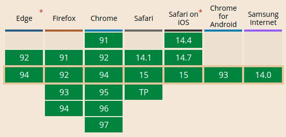
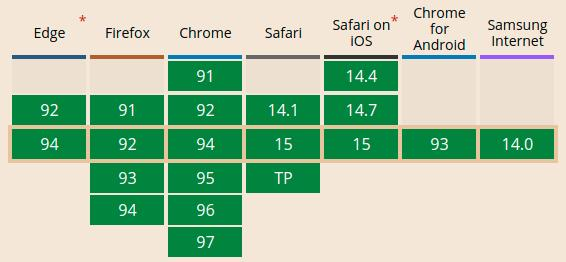

<div align="center">
    
</div>

<h2 align="center">A Non-Intrusive Request Mocking</h2>

With RIM (Request Interceptor Mock) you can normally perform all HTTP requests locally which it will intercept and return the mock data to the Client.

## Summary

- [Summary](#summary)
- [Requirements](#requirements)
- [Instalation](#instalation)
- [Configuration](#configuration)
- [How it works](#how-it-works)

## Requirements

**Fetch API**



**ServiceWorker**



## Instalation

`npm`:

```javascript
npm install --save-dev 'request-interceptor-mock';
```

`yarn`:

```javascript
yarn add -D 'request-interceptor-mock';
```

## Configuration

`rim` uses a simplified configuration so that the focus is on the development experience, increasing developer productivity, see an example below:

**Initialization**

```javascript
import rim from 'request-interceptor-mock';

rim.init({
    environment: 'development',
    environmentAllowList: ['development'],
    mocksPath: './src/mocks',
})
```

That's the setup, simple right! But now we need to define and structure our mocks, let's go!

**Mocks Structure**

First we recommend that you create a folder called `mocks` inside your project's `src` folder, but it can be wherever you want as long as you enter the relative path, prefixed with the `./` path as in the previous example.

Next, we'll define the structure of our mocks, they must follow the format below to work correctly:

```javascript
const githubAPIMock = {
    request: {
        url: 'https://api.github.com/users/anyuser',
        headers: {
            "Content-Type": "application/json"
        }
    },
    response: {
        "login": "anyuser",
        "id": 4643258,
    }
};

const mocks = [
    githubAPIMocks,
];

export default mocks;
```

Simple and easy, isn't it?

## How it works

The `rim` listens for requests made by the *Fetch API* through a resource called *ServiceWorker* and when it finds a request that matches the url, headers and data it intercepts and returns the corresponding mock, but the cool thing about it it will only intercept in the environment where it was allowed to run, outside that environment the request follows its normal flow.